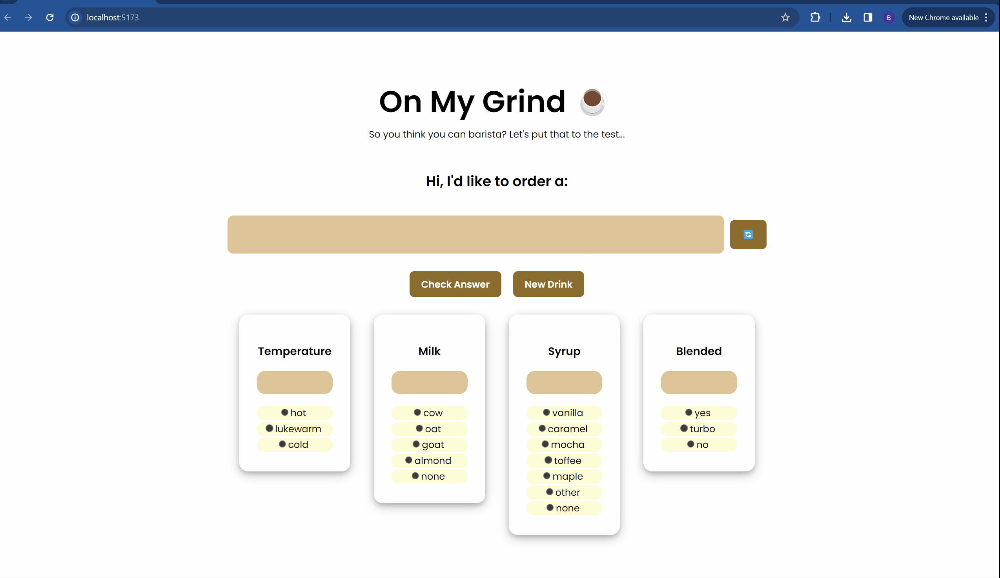

# Web Development Lab 3 - *On My Grind ☕*

Submitted by: **Bryan Reyes**

This web app: **This project was created as a Starbucks drink receipe simulator. The user is given a random drink and chooses from the list of ingredients to quiz themselves on their knowledge of Starbucks drinks.**

Time spent: **24** hours spent in total

## Required Features

The following **required** functionality is completed:

- [X] **One drink at a time is displayed**
- [X] **The user can click one option for each of the four categories to input their answer**
- [X] **The selected option populates into the box above, and if an option is already int he box, it is replaced by the new option**
- [X] **Clicking "check answer" submits the answer to be checked for correctness**
- [X] **After clicking "check answer", the user can see which components of a drink they entered correctly and incorrectly by having the box for that answer change visually**
- [X] **Clicking on the new drinnk button shows a new drink and clears the input boxes**

The following **optional** features are implemented:

- [] The user can type in their response in each box instead of having to click on the option, and typed inputs are properly validated

The following **additional** features are implemented:

* [] n/A

## Video Walkthrough

Here's a walkthrough of implemented required features:

<!-- Replace this with whatever GIF tool you used! -->
GIF created with ScreenToGif
<!-- Recommended tools:
[Kap](https://getkap.co/) for macOS
[ScreenToGif](https://www.screentogif.com/) for Windows
[peek](https://github.com/phw/peek) for Linux. -->

## Notes

The learning curve in regards to handling user input in a variety of different ways was steep, but the lab made the concepts fun to learn! I believe the most difficult part of the lab, in my opinion, was adjusting the CSS to make the app more user-friendly and uniform with all components.

## License

    Copyright [2024] [Bryan Reyes]

    Licensed under the Apache License, Version 2.0 (the "License");
    you may not use this file except in compliance with the License.
    You may obtain a copy of the License at

        http://www.apache.org/licenses/LICENSE-2.0

    Unless required by applicable law or agreed to in writing, software
    distributed under the License is distributed on an "AS IS" BASIS,
    WITHOUT WARRANTIES OR CONDITIONS OF ANY KIND, either express or implied.
    See the License for the specific language governing permissions and
    limitations under the License.